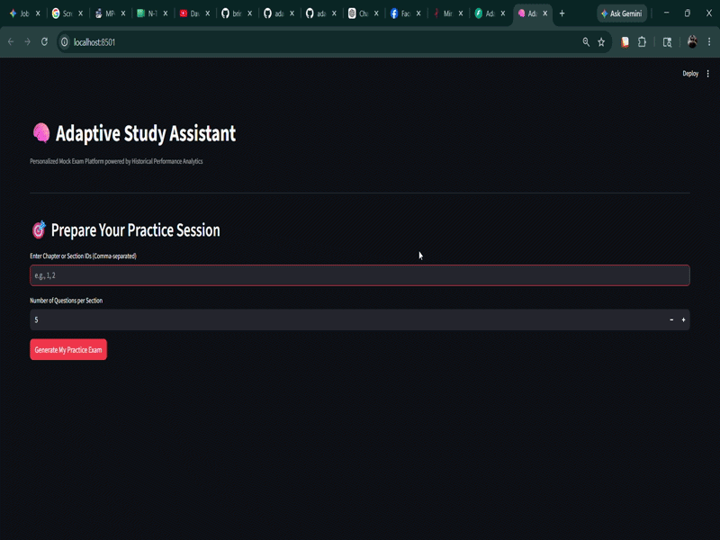

# Adaptive Document Preparation System

<p align="center">
  <b>
    Production-Style Adaptive RAG Backend & Interactive Streamlit Interface
    for PDF-Based Study Preparation and MCQ Generation
  </b>
</p>

<p align="center">
  
  
  
  
  
  
  
  
  
  
  
  
  
  
  
  
  
</p>

---
---

# 📺 Live System Demonstration & Cloud Sandbox

<p align="center">
  <a href="https://huggingface.co/spaces/bringerofdarkness/adaptive-document-prep" target="_blank">
    
  </a>
</p>

> [!TIP]  
> **🧠 Standalone Live Simulation:** Want to try the interface instantly? Click the Hugging Face badge above to explore the frontend application flow. 
> *Note: Due to resource constraints on the Hugging Face free CPU layer, the live space runs in an **In-Memory Simulation Mode** (micking backend responses). It does not spin up the heavy distributed background worker stack (PostgreSQL, Qdrant cluster, Redis, and Celery). To experience the **full potential and end-to-end multi-container architecture**, follow the [Fresh Setup on a New PC](#fresh-setup-on-a-new-pc) below.*

---

> [!NOTE]  
> **Beyond the Specification:** Although the primary assessment guidelines emphasized building a solid history-adaptive CLI architecture first, I engineered an interactive, real-time **Streamlit Frontend Interface** to visually demonstrate the underlying adaptive intelligence and evaluation loops in action.

<p align="center">
  
</p>

*The above demonstration highlights the full loop: Ingestion -> Cold Start Generation -> Real-time Performance Tracking -> On-the-fly Prompt Adaptation for returning weak areas.*
---

# Overview

Adaptive Document Preparation System is a production-style adaptive RAG backend designed for structured PDF-based preparation workflows.

The platform ingests large multi-section PDFs, stores semantic embeddings inside Qdrant, tracks learning history in PostgreSQL, generates MCQs through LLM pipelines, scores user submissions, identifies weak topics, and adapts future question generation based on historical mistakes.

This project was built to demonstrate something beyond a basic RAG implementation.

The core engineering focus is:

- adaptive preparation behavior
- deterministic retrieval boundaries
- historical learning persistence
- reviewer-auditable evaluation workflows
- asynchronous scalable orchestration

---

# Documentation

<table>
<tr>
<th align="left">File</th>
<th align="left">Purpose</th>
</tr>

<tr>
<td>
<a href="docs/architecture.md">Architecture</a>
</td>
<td>
Hybrid RAG architecture, ingestion pipeline, retrieval boundaries, orchestration flow
</td>
</tr>

<tr>
<td>
<a href="docs/database_schema.md">Database Schema</a>
</td>
<td>
PostgreSQL relational schema, session persistence, weak-topic indexing, KB relationships
</td>
</tr>

<tr>
<td>
<a href="docs/adaptation_strategy.md">Adaptation Strategy</a>
</td>
<td>
Adaptive logic, weak-topic tracking, cold-start vs adaptive execution behavior
</td>
</tr>

<tr>
<td>
<a href="docs/optional_enhancements.md">Optional Enhancements</a>
</td>
<td>
Production scalability decisions, async architecture, optimization strategies, resilience engineering
</td>
</tr>

</table>

---

# Recommended Reading Order

```text
1. docs/architecture.md
2. docs/database_schema.md
3. docs/adaptation_strategy.md
4. docs/optional_enhancements.md
```

---

# Architecture Overview

```text
[ User Interaction via Streamlit Web UI ]
                                          │
                                          ▼
                             [ FastAPI REST API Gateway ]
                             (Instantly Returns 202 Task)
                                          │
                 ┌────────────────────────┴────────────────────────┐
                 ▼ (Async Broker Push)                             ▼ (Storage Audit)
      [ Redis Message Broker ]                        [ MinIO S3 Object Repository ]
            (Port 6380)                                  (Raw PDF Document Vault)
                 │                                                 │
                 ▼ (Worker Thread Pick)                            ▼ (Source Fetch)
      [ Celery Asynchronous Workers ] ─────────────────────────────┘
       - Fixed-Window Multi-Section Batching
       - Offline Transformers Local Cache
                 │
                 ▼
      [ LangGraph Stateful Workflows ]
       (Retrieval + Adaptation Payloads)
                 │
                 ▼
        [ Qdrant Vector Engine ]
       (Strict Section Partition Filter)
                 │
                 ▼
      [ Upstream LLM Inference Tier ]
        (Groq Llama-3 / Mock Fallback)
                 │
                 ▼
      [ Pydantic Validation & ftfy Cleanup ]
                 │
                 ▼
      [ PostgreSQL Persistence Core ]
       (Bulk db.add_all Relational Flushes)
                 │
                 ▼
      [ Streamlit Performance Rendering ]
       (Human-Readable Snapshots & Explanations)
```

---

# Table of Contents

- [Project Highlights](#project-highlights)
- [Current Verified Status](#current-verified-status)
- [Repository](#repository)
- [Prerequisites](#prerequisites)
- [Fresh Setup on a New PC](#fresh-setup-on-a-new-pc)
- [Environment Variables](#environment-variables)
- [Start Docker Services](#start-docker-services)
- [Prepare the Knowledge Base](#prepare-the-knowledge-base)
- [Run Evaluation Scenarios](#run-evaluation-scenarios)
- [Run Tests](#run-tests)
- [Run Workers, Backend & Frontend](#run-workers-backend--frontend)
- [API Usage](#api-usage)
- [Architecture Summary](#architecture-summary)
- [LangGraph Workflow](#langgraph-workflow)
- [Adaptation Strategy](#adaptation-strategy)
- [Project Structure](#project-structure)
- [Useful Commands](#useful-commands)
- [Final Project Pitch](#final-project-pitch)

---

# Project Highlights

This project implements the complete adaptive preparation workflow required by the assessment.

### Features

- Structured PDF ingestion
- Section-aware semantic chunking
- PostgreSQL historical persistence
- Qdrant vector retrieval
- Strict selected-section filtering
- LLM-driven MCQ generation
- Adaptive learning sessions
- Weak-topic tracking
- Async task orchestration
- FastAPI REST backend
- Streamlit interactive frontend
- Reviewer-ready Scenario A/B exports
- Mock fallback execution for offline testing
- Deterministic validation pipelines

---

# Core Adaptive Logic

```text
first-time relevant run -> cold_start
returning relevant run  -> adaptive
```

---

# Current Verified Status

Core backend functionality is fully operational.

## Verified Features

```text
PDF ingestion                              Passed
10-section extraction                      Passed
PostgreSQL persistence                     Passed
Qdrant indexing                            Passed
Strict selected-section retrieval          Passed
Groq MCQ generation                        Passed
Mock fallback generation                   Passed
Scenario A                                 Passed
Scenario B                                 Passed
Weak-topic persistence                     Passed
KB snapshot export                         Passed
FastAPI Swagger flow                       Passed
/prep/start                                Passed
/prep/task/{task_id}                       Passed
/prep/submit                               Passed
/sessions/{session_id}                     Passed
/kb/snapshot                               Passed
Interactive Streamlit UI                   Passed
Automated tests                            6 passed
```

---

# Latest Verified Adaptive Runs

```text
Scenario B iteration 1 | sections [5, 8]    | mode=cold_start | score=50.0
Scenario B iteration 2 | sections [6, 8, 9] | mode=adaptive   | score=66.67
Scenario B iteration 3 | sections [8]       | mode=adaptive   | score=0.0
```

---

# Repository

```bash
git clone https://github.com/bringerofdarkness/adaptive-document-prep-Cloudly
```

---

# Prerequisites

## Recommended Environment

```text
Python 3.13+
Docker Desktop
Windows PowerShell or compatible terminal
Groq API key for real LLM generation
```

## Required Services

```text
PostgreSQL  -> Port 5433
Qdrant      -> Port 16433
Redis       -> Port 6380
```

All services run through Docker Compose.

---

# Fresh Setup on a New PC

## 1. Clone the Repository

```powershell
git clone https://github.com/bringerofdarkness/adaptive-document-prep-Cloudly.git

cd adaptive-document-prep-Cloudly
```

---

## 2. Create Virtual Environment

### Windows PowerShell

```powershell
python -m venv .venv

.\.venv\Scripts\Activate.ps1
```

If the global `python` command is not configured:

```powershell
Set-ExecutionPolicy -Scope Process -ExecutionPolicy Bypass

py -m venv .venv

.\.venv\Scripts\Activate.ps1
```

### macOS / Linux

```bash
python -m venv .venv

source .venv/bin/activate
```

---

## 3. Install Dependencies

```powershell
python -m pip install --upgrade pip

python -m pip install -r requirements.txt
```

---

## 4. Create `.env`

### Windows

```powershell
Copy-Item .env.example .env
```

### macOS / Linux

```bash
cp .env.example .env
```

Configure your API key:

```env
LLM_PROVIDER=groq
GROQ_API_KEY=your_groq_api_key_here
```

Optional deterministic local testing:

```env
LLM_PROVIDER=mock
```

Never commit `.env`.

---

# Environment Variables

```env
APP_NAME="Adaptive Document Preparation System"
APP_ENV=local

API_HOST=0.0.0.0
API_PORT=8090

POSTGRES_HOST=localhost
POSTGRES_PORT=5433
POSTGRES_DB=adaptive_doc_prep
POSTGRES_USER=postgres
POSTGRES_PASSWORD=postgres

QDRANT_HOST=localhost
QDRANT_PORT=16433
QDRANT_COLLECTION=slatefall_chunks

EMBEDDING_MODEL=sentence-transformers/all-MiniLM-L6-v2

LLM_PROVIDER=groq
GROQ_API_KEY=

REDIS_HOST=localhost
REDIS_PORT=6380
REDIS_DB=0

CELERY_BROKER_URL=redis://localhost:6380/0
CELERY_RESULT_BACKEND=redis://localhost:6380/0

QDRANT_SCORE_THRESHOLD=0.75

MINIO_ENDPOINT=localhost:9000
MINIO_ACCESS_KEY=minioadmin
MINIO_SECRET_KEY=minioadminpassword
MINIO_SECURE=False
MINIO_BUCKET_NAME=raw-dossiers
```

---

# Start Docker Services

```powershell
docker compose up -d
```

---

# Verify Services

## PostgreSQL

```powershell
docker exec adaptive_doc_postgres pg_isready -U postgres -d adaptive_doc_prep
```

## Qdrant

```powershell
Invoke-RestMethod http://127.0.0.1:16433/healthz
```

## Redis

```powershell
python -c "import redis; r = redis.Redis(host='localhost', port=6380, db=0); print('Redis Live:', r.ping())"
```

---

# Prepare the Knowledge Base

PDF location:

```text
data/SLATEFALL_DOSSIER.pdf
```

---

## Step 1 — Reset Database

```powershell
python -m cli.reset_db reset
```

---

## Step 2 — Clear Qdrant Collection

```powershell
Invoke-RestMethod -Uri http://localhost:16433/collections/slatefall_chunks -Method Delete
```

---

## Step 3 — Ingest PDF

```powershell
python -m cli.ingest_pdf
```

Expected:

```text
Pages: 50
Sections: 10
Chunks: 101
```

---

## Step 4 — Index Embeddings

```powershell
python -m cli.index_qdrant
```

Expected:

```text
Chunks to index: 101
Qdrant indexing complete.
```

---

## Step 5 — Verify Counts

```powershell
Invoke-RestMethod -Uri http://localhost:16433/collections/slatefall_chunks `
| Select-Object -ExpandProperty result `
| Select-Object status, points_count
```

Expected:

```text
status points_count
------ ------------
green           101
```

---

# Run Evaluation Scenarios

## Scenario A

```powershell
python -m cli.run_scenario_a --questions-per-section 5
```

Generated:

```text
outputs/scenario_a/questions_scenario_a.json
outputs/scenario_a/kb_snapshot_scenario_a.json
```

---

## Scenario B

```powershell
python -m cli.run_scenario_b --questions-per-section 5
```

Generated:

```text
outputs/scenario_b_iter1/questions_iter1.json
outputs/scenario_b_iter1/kb_snapshot_iter1.json

outputs/scenario_b_iter2/questions_iter2.json
outputs/scenario_b_iter2/kb_snapshot_iter2.json

outputs/scenario_b_iter3/questions_iter3.json
outputs/scenario_b_iter3/kb_snapshot_iter3.json
```

---

## Full Evaluation

```powershell
python -m cli.run_evaluation --questions-per-section 5
```

---

# Run Tests

```powershell
python -m pytest tests
```

Expected:

```text
6 passed
```

---

# Run Workers, Backend & Frontend

Open three separate terminals with the virtual environment activated.

---

## Run Celery Worker

```powershell
$env:PYTHONPATH="."

python -m celery -A app.core.celery_app.celery_app worker --loglevel=info -P threads
```

---

## Run FastAPI Server

```powershell
$env:PYTHONPATH="."

python -m uvicorn app.main:app --host 127.0.0.1 --port 8090
```

Swagger UI:

```text
http://127.0.0.1:8090/docs
```

---

## Run Streamlit Frontend

```powershell
streamlit run app_ui.py
```

Frontend URL:

```text
http://localhost:8501
```

---

# API Usage

## Health Check

```http
GET /health
```

---

## List Latest Document Sections

```http
GET /documents/latest/sections
```

---

## Start a Prep Session

```powershell
Invoke-RestMethod -Uri http://127.0.0.1:18000/prep/start `
-Method Post `
-ContentType "application/json" `
-Body '{
  "selected_section_numbers": [5, 8],
  "questions_per_section": 5
}'
```

### Response Example

```json
{
  "task_id": "6e007c87-d6db-44c4-96ba-6191764abca1",
  "status": "QUEUED",
  "message": "Adaptive generation pipeline initiated successfully in background thread workers."
}
```

---

## Track Worker Task Status

```powershell
Invoke-RestMethod -Uri http://127.0.0.1:18000/prep/task/Your-Task-ID
```

---

## Submit Batch Answers

```powershell
Invoke-RestMethod -Uri http://127.0.0.1:18000/prep/submit `
-Method Post `
-ContentType "application/json" `
-Body '{
  "session_id": "YOUR_SESSIONS_UUID_HERE",
  "answers": {
    "QUESTION_ID_1": "A",
    "QUESTION_ID_2": "B"
  }
}'
```

---

# PDF Section Mapping

| Section | Title | Pages |
|---|---|---|
| 1 | Identity, Background, and Public Status | 1–4 |
| 2 | Powers, Abilities, and Documented Limits | 4–11 |
| 3 | Origin and Key Historical Events | 11–15 |
| 4 | Equipment, Gear, and Specialized Technology | 15–22 |
| 5 | Operational Tactics and Combat Doctrine | 22–25 |
| 6 | Allies, Networks, and Known Affiliations | 25–30 |
| 7 | Adversaries and Documented Threats | 30–36 |
| 8 | Known Bases, Safehouses, and Operational Territory | 36–39 |
| 9 | Case Files: Documented Engagements and Incidents | 39–43 |
| 10 | Glossary, Codenames, and Reference Tables | 43–50 |

---

# Architecture Summary

```text
PostgreSQL = Historical state, scoring, weak-topic tracking
Qdrant     = Section-filtered semantic retrieval
LangGraph  = Adaptive orchestration workflow
Streamlit  = Interactive presentation layer
```

---

# LangGraph Workflow

```text
load_document_and_history
        │
        ▼
retrieve_selected_section_chunks
        │
        ▼
generate_questions
        │
        ▼
simulate_and_score_answers
        │
        ▼
persist_session
```

---

# Adaptation Strategy

## Cold Start

```text
No prior history exists for selected sections.
```

## Adaptive

```text
Previous mistakes and weak topics influence future question generation.
```

The backend explicitly owns adaptation metadata generation instead of delegating trust entirely to LLM responses.

---

# MCQ Validation

Validation guarantees:

- Exactly 4 answer choices
- Strict A/B/C/D schema
- Retry-on-invalid-generation behavior
- Section-boundary enforcement
- Structured response normalization

---

# Encoding Cleanup

The project uses `ftfy` normalization to repair mojibake artifacts introduced during PDF extraction.

Example:

```text
Cuartel Valparaíso
```

becomes:

```text
Cuartel Valparaíso
```

---

# Project Structure

```text
app/
├── api/           FastAPI route modules
├── core/          settings, logging, exceptions
├── db/            SQLAlchemy models, repositories
├── ingestion/     PDF parsing and chunking
├── retrieval/     Embeddings and Qdrant retrieval
├── llm/           Providers, prompts, validation
├── background/    Celery worker logic
├── workflow/      LangGraph graph orchestration
├── services/      Business logic
└── schemas/       Pydantic request/response schemas

cli/               CLI execution scripts
docs/              Architecture and strategy docs
outputs/           Scenario outputs and KB snapshots
tests/             Automated tests
app_ui.py          Streamlit frontend interface
```

---

# Useful Commands

## Service Boot

```powershell
docker compose up -d
```

## Reset Database

```powershell
python -m cli.reset_db reset
```

## PDF Processing

```powershell
python -m cli.ingest_pdf

python -m cli.index_qdrant
```

## Full Evaluation

```powershell
python -m cli.run_evaluation --questions-per-section 5
```

## Start Workers & API

```powershell
$env:PYTHONPATH="."

python -m celery -A app.core.celery_app.celery_app worker --loglevel=info -P threads

python -m uvicorn app.main:app --host 127.0.0.1 --port 8090

streamlit run app_ui.py
```

---

# Development Note

This project was independently implemented and validated by the project author.

AI tools were used as supplementary assistants for:

- brainstorming
- debugging support
- documentation refinement
- reviewing implementation decisions

All final architecture, implementation logic, testing, validation, and maintenance decisions were reviewed and owned by the project author.

---

# Final Project Pitch

This project demonstrates a production-style adaptive RAG backend capable of:

- ingesting structured PDFs
- indexing semantic embeddings in Qdrant
- maintaining historical learning state in PostgreSQL
- generating MCQs using LLM pipelines
- validating structured outputs
- tracking weak-topic evolution
- adapting future evaluation sessions
- exporting reviewer-ready execution artifacts

The system demonstrates deterministic adaptive preparation behavior across repeated study sessions while maintaining strict retrieval boundaries, persistence guarantees, and auditable evaluation outputs.

---

# License

This project is intended for educational, research, and engineering portfolio demonstration purposes.